# HEDIS Hospital Analysis 📊

🔗 [View Project on GitHub](https://github.com/ChapaMchivi/hedis-hospital-analysis)

This notebook simulates a hospital dataset and applies HEDIS-aligned analytics, including:

-  Data cleaning & feature engineering  
-  Univariate & bivariate analysis  
-  Simulated screening flags (cancer, diabetes, BP)  
-  Outlier detection & audit flagging  
-  Stratified reporting dashboards  

##  Changelog

**v1.1.0**
- Refactored screening logic for cancer, diabetes, and BP flags
- Improved dashboard visuals and stratification
- Synced README with updated logic

## 🔧 Tech Stack  
- Python (pandas, seaborn, matplotlib)  
- Jupyter Notebook  
- GitHub for version control  

##  Structure  
- `hedis-hospital-analysis.ipynb`: Main notebook  
- `data/`: Simulated or anonymized datasets  
- `images/`: Visual assets (charts, dashboards)  
- `README.md`: Project overview  
- `requirements.txt`: Package list  
- `venv/`: Virtual environment (optional)

##  Reproducibility  
- Virtual environment setup: `python -m venv venv`  
- Install packages: `pip install -r requirements.txt`

##  Visual Summary

Below are key visualizations from the HEDIS hospital analysis notebook:

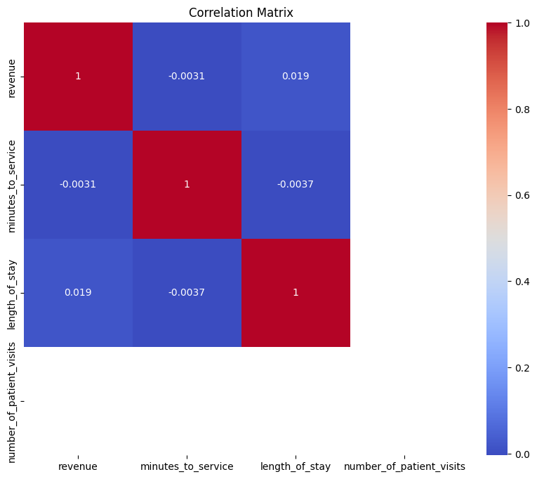

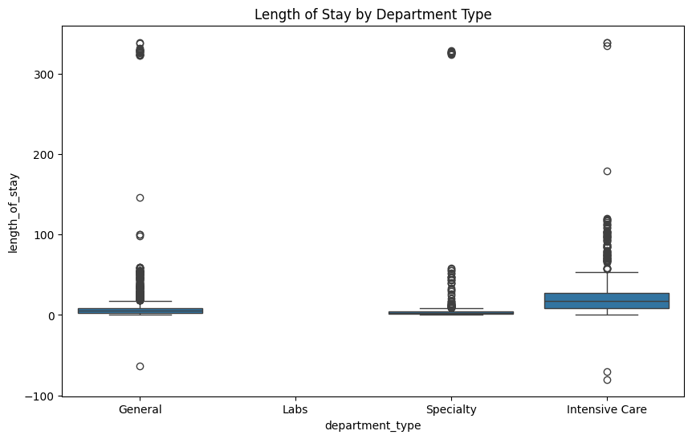
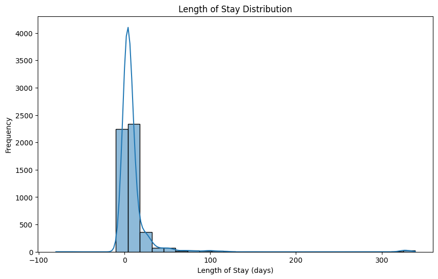
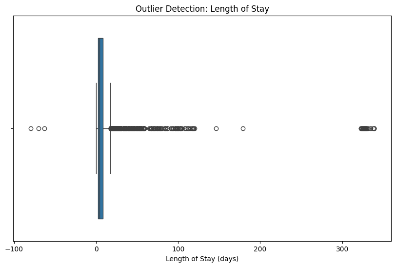
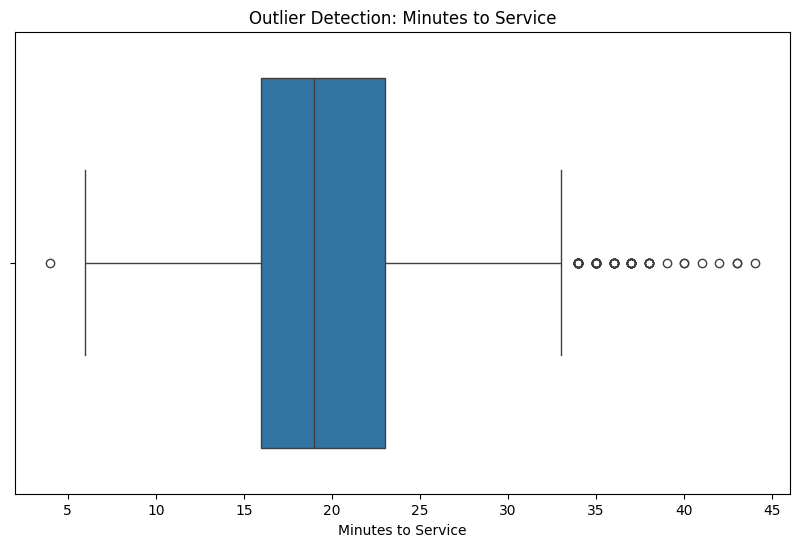
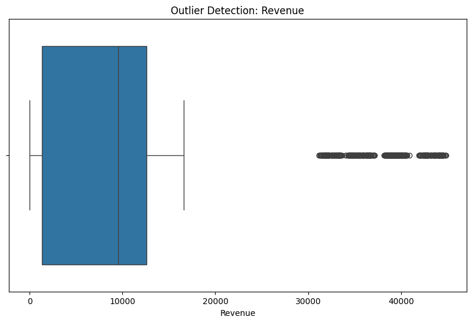
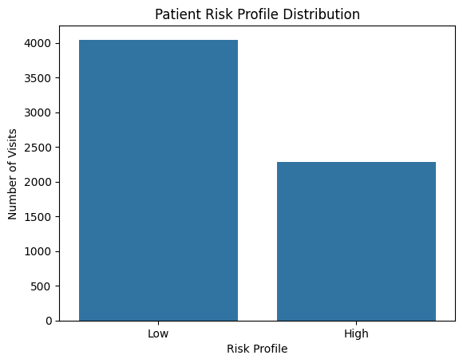
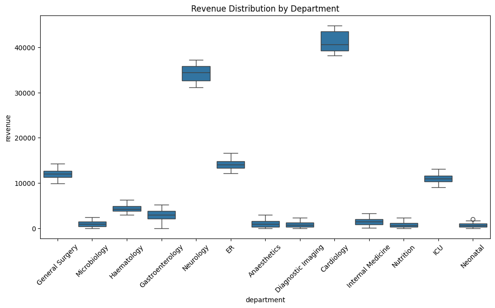
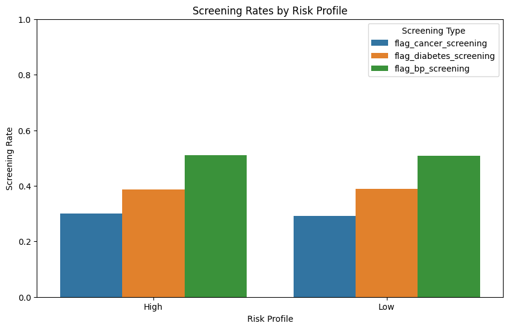
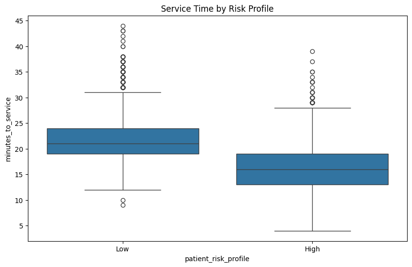
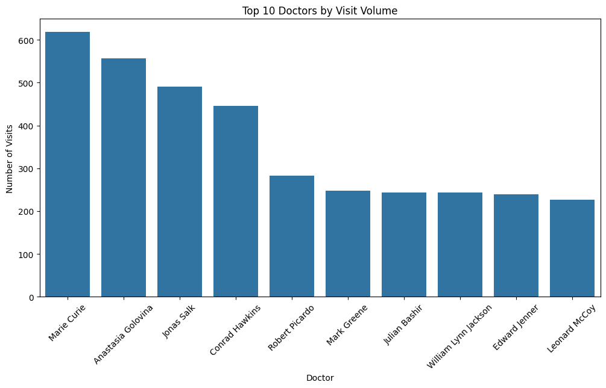
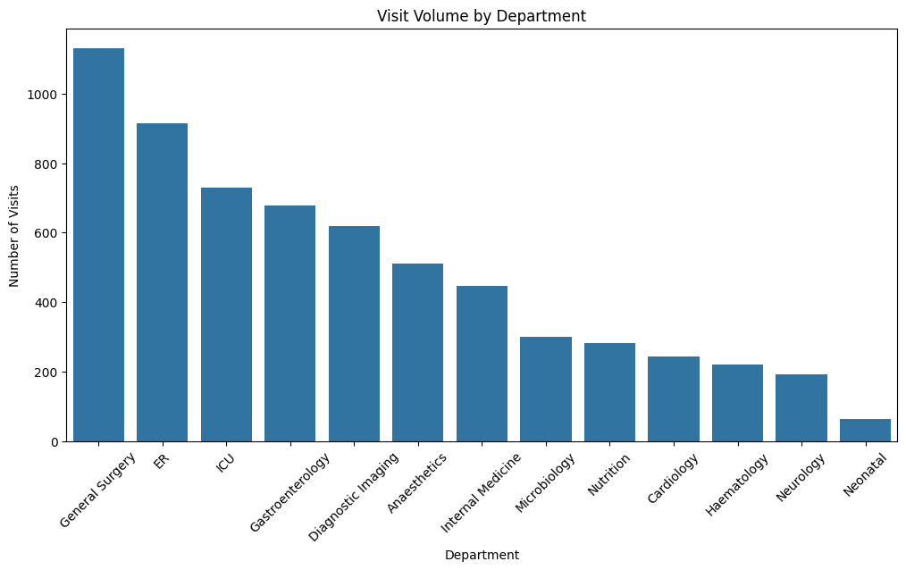

